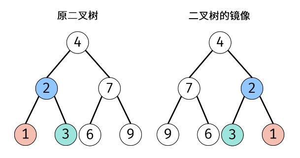
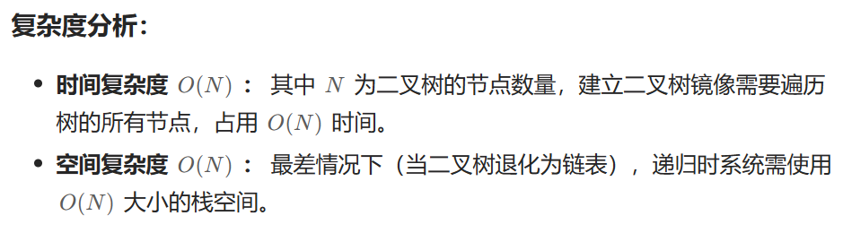
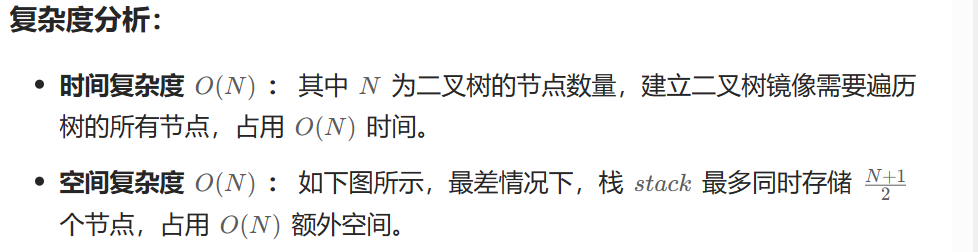
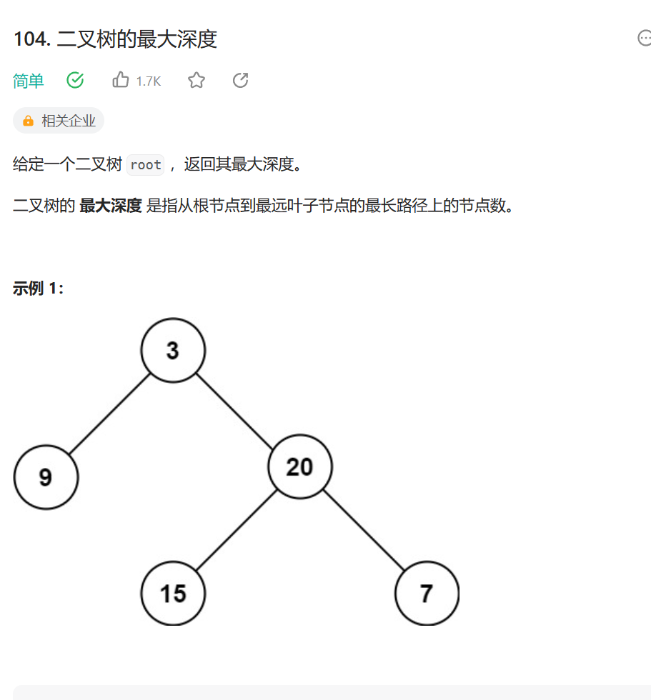

# 需要掌握递归和非递归写法，考试有时会出非递归
```java
  //Definition for a binary tree node.
  struct TreeNode {
      int val;
      TreeNode *left;
      TreeNode *right;
      TreeNode() : val(0), left(nullptr), right(nullptr) {}
      TreeNode(int x) : val(x), left(nullptr), right(nullptr) {}
      TreeNode(int x, TreeNode *left, TreeNode *right) : val(x), left(left), right(right) {}
  };
```


# 树的对称轴有关的题  

### 翻转二叉树

递归代码  
```java
    class Solution {
    public:
    
    
    TreeNode* invertTree(TreeNode* root) {
        if(root == NULL) {
            return NULL;
        }
        //递归当前逻辑：交换当前root的左右节点 
        //深入下去找到左右节点
        TreeNode* left = invertTree(root->left);
        TreeNode* right = invertTree(root->right);
        //从下面回来的过程中，将当前节点的左右节点交换
        root->right = left;
        root->left = right;
        return root;
    }
    
    
    
};
```


迭代思路  
辅助栈或者队列   
直接层序往下一层层遍历，依次存入栈，然后弹栈出来，交换弹栈出来的栈顶的左右子树



### 对称二叉树
```java

```

### 另一颗树的子树
```java

```

### 相同的树 
```java
class Solution {
public:
    bool isSameTree(TreeNode* p, TreeNode* q) {
        if(p == NULL && q == NULL) {return true;}
        if((p == NULL && q != NULL) || (p != NULL && q == NULL)) {
            return false;       
        }
        //剩下两个都有节点就比较节点的值   ，节点值都不相同就别下去找了，浪费时间
        if(p->val != q->val) {return false;}
        //接下来比较左节点和右节点 
        bool left = isSameTree(p->left,q->left);
        bool right = isSameTree(p->right,q->right);
        return left&&right;
    }
};
```
  

### 二叉树的最大深度

前序中左右
```java
class Solution {
public:
    int maxDepth(TreeNode* root) {
        //其实就是层数，可以用递归或者层序
        int Max = 0;
        digui(root,0,Max);
        return Max;
    }
    void digui(TreeNode * root,int num,int& Max) {
        //如果进来发现root是空，就比较Max和num的值
        if(root == NULL) {
            Max = num>Max?num:Max;
            return;
        }
        //管你有没有节点，进去就完事了
        digui(root->left,num+1,Max);
        digui(root->right,num+1,Max);
    }
};
```

简便版本
```java
    int maxDepth(TreeNode* root) {
        if (root == NULL) return 0;
        return  max(maxDepth(root->left),maxDepth(root->right))+1; //就算只有一层也可以加自己  
    }
```
层序遍历
```java
    int maxDepth(TreeNode* root) {
        if(root == NULL) {return 0;}
        queue<TreeNode*> que;
        que.push(root);
        int depth = 0;
        while(!que.empty()) {
            int size = que.size();
            while(size -- > 0) {
            TreeNode* node = que.front();//弹出这一层的root
            que.pop();
            if(node->left != NULL) {que.push(node->left);}
            if(node->right != NULL) {que.push(node->right);}
            }
            depth++;
        }
        return depth;
    }
```

