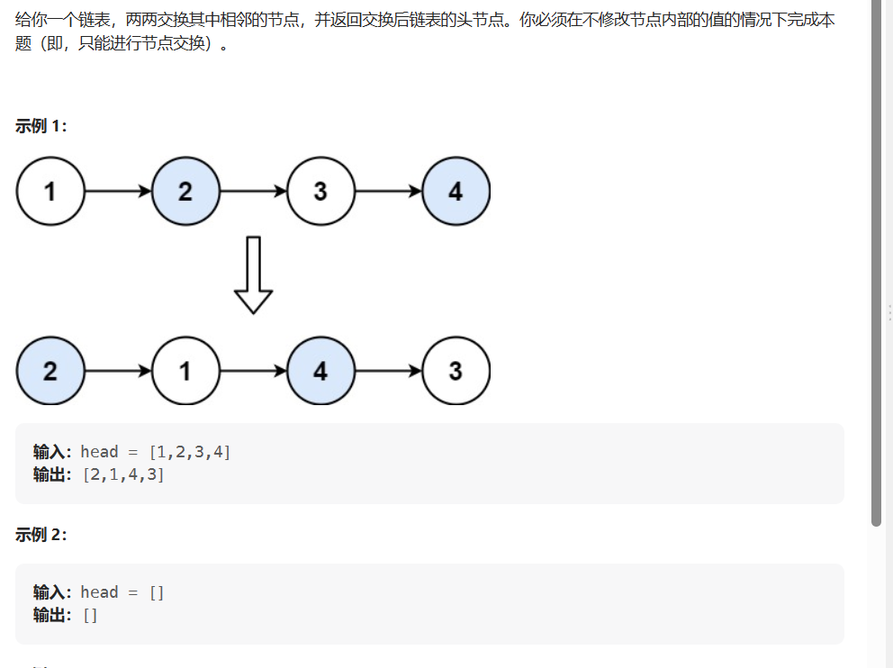
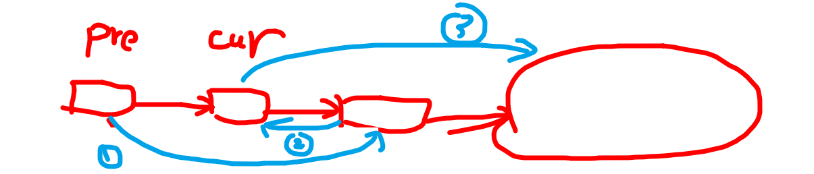

### 重排链表  
```java


```


### 反转链表  

```java
    ListNode* reverseList(ListNode* head) {
        //要么他自己是NULL,要么就下一个就是NULL，则此时head->next就是尾节点  
        if(head == NULL || head->next == NULL) {return head;}
        //递归到最后一个节点，然后后来的过程改变指针的方向  
        ListNode * digui = reverseList(head->next);
        //上面的递归式子，head->next进去之后又判定他的next指向了最后的null，故这是尾节点，我们要一直返回到最开始的地方作为函数答案，在返回的过程中反转链表
        //让head的下一个节点指向自己也就是形成了反转  
        head->next->next = head;
        //把前面的连接断了 
        head->next = NULL;
        return digui;
        }
```

### 两两交换链表节点 
   
     
```java
    ListNode* swapPairs(ListNode* head) {
       if(head == NULL) {return NULL;}
       ListNode * dummpy = new ListNode(-1,head);
       ListNode *pre = dummpy;
       ListNode *cur = head;
       while(cur != NULL && cur->next!=NULL) {
           pre->next = cur->next;
           ListNode * temp = cur->next->next;
           cur->next->next = cur;
           cur->next = temp;
           pre = cur;
           cur = temp;
       }
       return dummpy->next;
    }
```

### 删除链表的倒数第N个结点  
双指针之快慢指针
```java
class Solution {
public:
    ListNode* removeNthFromEnd(ListNode* head, int n) {
        ListNode *dummpy = new ListNode(0);
        dummpy->next = head;
        ListNode *slow = dummpy;
        ListNode *fast = dummpy;
        int num = 0;
        //先让指针走n步，当快指针=null时，慢指针>next=倒数第N个节点了
        while(fast!=NULL && num < n) {
            fast = fast->next;
            num++;
        }

        while(fast != nullptr && fast->next != nullptr) {
            slow = slow->next;
            fast = fast->next;
        }
        //此时找到想要的节点的前一个r
        slow->next = slow->next->next;
        ListNode * ans = dummpy->next;
        delete dummpy;
        return ans;
    }
};
```

### 重排链表  

